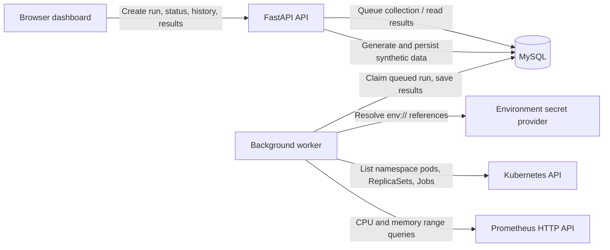
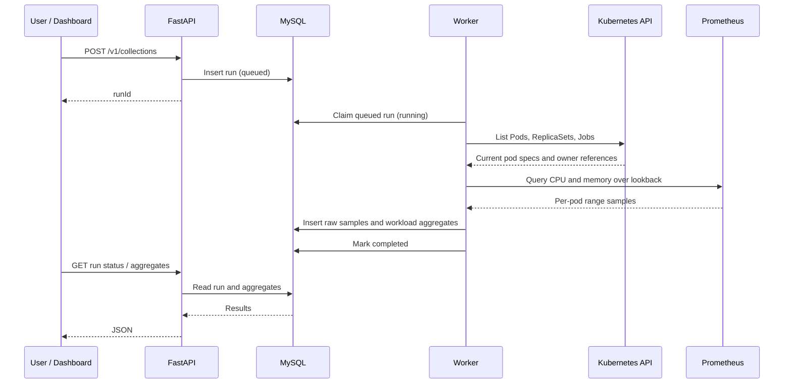

# Architecture and how the application works

## Purpose

The application collects Kubernetes resource allocation and Prometheus usage for a namespace, groups pod data by workload, calculates averages and peaks, and suggests CPU/memory requests and limits. It can also calculate optional request-based monthly and yearly cost estimates from rates supplied by the user.

The project has two data paths:

- **Synthetic demo:** generates labeled sample records directly in the API process. It needs no Kubernetes or Prometheus.
- **Live collection:** queues work for a separate background worker, which reads Kubernetes and Prometheus and writes raw samples and workload aggregates to MySQL.

## Architecture




### Components

| Component | Responsibility |
| --- | --- |
| Dashboard (`app/static/index.html`) | Collects user inputs, submits runs, polls status, shows recent runs, charts, aggregates, recommendations, and optional cost estimates. |
| FastAPI (`app/main.py`) | Serves the dashboard and JSON API; validates requests; queues live runs; returns run status, recent history, and aggregate results. |
| MySQL (`app/models.py`, `app/db.py`) | Stores collection-run metadata, raw pod samples, and per-workload aggregates. The Compose setup stores MySQL files in the named `mysql_data` volume. |
| Worker (`app/worker.py`, `app/service.py`) | Polls MySQL for queued runs, claims one run, performs collection, persists raw samples and aggregates, and records success or failure. |
| Collector (`app/collector.py`) | Uses the Kubernetes Python client and Prometheus HTTP API to obtain and correlate allocation and usage data. |
| Secret provider (`app/secrets.py`) | In local development, resolves `env://NAME` from `APP_SECRET_NAME`. Resolved secret values are not stored in the collection record. This provider is disabled in production. |
| Demo generator (`app/demo.py`) | Produces deterministic synthetic workloads and hourly-like sample points, then persists them as a completed run. Runs are labeled `DEMO (synthetic)`. |
| Cost estimator (`app/costs.py`) | Estimates current and suggested request cost using the per-run rates supplied by the caller. |

The current application is single-tenant: there are no user, organization, or config identifiers or tenant-level data filters. Do not expose shared history/results to mutually untrusted users.

## Live collection flow

1. A caller submits `POST /v1/collections` with environment, namespace, lookback days, Kubernetes kubeconfig secret reference, Prometheus URL, optional Prometheus token reference, query step, recommendation settings, and optional CPU/memory cost rates.
2. FastAPI validates the request and inserts a `collection_runs` row with a generated run ID and `queued` status. Collection inputs/references are saved for the worker; resolved credentials are not.
3. The worker polls for a queued row. It claims one row using a database row lock (`FOR UPDATE SKIP LOCKED`), sets the status to `running`, and records the start time.
4. The collector resolves the kubeconfig secret, loads it into the Kubernetes Python client, and lists namespace Pods, ReplicaSets, and Jobs.
5. It reads CPU/memory requests and limits from each currently listed pod's regular container specifications. Owner references map pods to Deployments through ReplicaSets, and to CronJobs through Jobs when those owner objects still exist.
6. The collector requests Prometheus range data for the run's lookback:
   - Default CPU query: `rate(container_cpu_usage_seconds_total{...}[5m])`, grouped by pod. Values are CPU cores.
   - Default memory query: `container_memory_working_set_bytes{...}`, grouped by pod. Values are bytes.
   - Historical ownership queries use `last_over_time` on `kube_pod_owner` and `kube_job_owner`, then join pod→Job→CronJob. A recent owner sample is accepted for up to five minutes to cover scrape/evaluation gaps.
   - Evaluation spacing is selected with `stepSeconds`; the default is 300 seconds.
7. Pod values at each timestamp are combined into workload totals. The collector calculates mean and maximum observed workload CPU and memory values, then applies the recommendation policy.
8. The worker writes rows to `raw_usage_samples` and `workload_aggregates` and marks the run `completed`. If collection fails, the worker marks the run `failed` and records an error message.
9. The dashboard polls `GET /v1/collections/{runId}`. When complete, it requests `GET /v1/collections/{runId}/aggregates` and displays the result. Client-side filters select one or more workload types and search one or multiple names; the visible charts, table, summary, and cost estimates update together. CronJob aggregates already include the associated Job usage.



## Synthetic demo flow

`POST /v1/demo/collections` does not enqueue a worker task. The API generates synthetic sample records for example Deployments, a StatefulSet, and CronJobs and inserts the run, raw rows, and aggregates directly in one database transaction. It requires no kubeconfig, Prometheus endpoint, or secret references. Synthetic results must not be presented as observed cluster data.

## Database tables

### `collection_runs`

One row per run: generated ID, environment, namespace, lookback days, state (`queued`, `running`, `completed`, or `failed`), JSON input settings, timestamps, and error details. The table has no user, organization, or config ID columns.

### `raw_usage_samples`

One row per run/pod/timestamp containing workload and pod identity, sampled CPU cores and memory bytes, and the current pod allocation values observed for that pod. Unique/indexed by run and sample identity for querying.

### `workload_aggregates`

One row per workload and run containing pod/sample counts, average and peak usage, current allocation totals, suggested requests/limits, and the policy inputs that produced the suggestions.

On a fresh database, tables are created during application startup using SQLAlchemy metadata. The app does not create a configuration table.

## Recommendation calculations

The default policy is peak-based:

- CPU request = peak CPU usage / target utilization, rounded up to 1 millicore.
- Memory request = peak working set / target utilization, rounded up to 1 MiB.
- CPU and memory limits = peak usage × configured headroom multiplier, rounded up to the same units, then kept at least as large as the suggested request.

Default target utilization is 80%; default headroom multiplier is 1.2. Values can be changed on each collection. A missing resource series does not produce a recommendation for that resource.

## Cost estimates

Cost rates are optional. To enable estimates, provide **both** CPU cost per vCPU-hour and memory cost per GiB-hour, plus a currency code. Per workload:

```text
hourly request cost =
    requested CPU cores × CPU rate per core-hour
  + requested memory bytes / 2^30 × memory rate per GiB-hour

monthly estimate = hourly request cost × 730
yearly estimate  = hourly request cost × 8760
estimated savings = current request estimate - suggested request estimate
```

This is an illustrative capacity/request-based estimate, not a cloud invoice prediction. It assumes resources are continuously allocated and does not model discounts, utilization billing, commitment pricing, or CronJob execution duration.

## API endpoints

| Method and path | Description |
| --- | --- |
| `GET /` | Browser dashboard. |
| `GET /healthz` | Liveness check. |
| `POST /v1/collections` | Queue a live Kubernetes/Prometheus collection. |
| `POST /v1/demo/collections` | Create a synthetic run; disabled when `ENVIRONMENT=production`. |
| `GET /v1/collections` | List the most recent runs (up to 50). |
| `GET /v1/collections/{runId}` | Read status and metadata for one run. |
| `GET /v1/collections/{runId}/aggregates` | Read completed workload aggregates and cost estimates. |
| `GET /v1/collections/{runId}/raw-samples?workloadName={name}&offset=0&limit=100` | Read paginated raw pod samples for one workload; the dashboard loads these when **View raw samples** is clicked. |
| `GET /v1/collections/{runId}/export.xlsx` | Download a workbook with all workload aggregates and all raw pod samples for a completed run. |
| `GET /docs` | Interactive OpenAPI documentation. |

Raw sample pages include pod, timestamp, CPU and memory usage, and the allocation values recorded for that sample. Pages are limited to 500 rows. Excel export contains a workload summary sheet and paginated-by-worksheet raw sample data; dashboard filters do not restrict the export.

## Local services and process boundaries

The simple synthetic quickstart runs MySQL, API, and worker in Docker Compose. A real Kind test in the README runs MySQL in Compose, but runs the API and worker on the host because the kubeconfig's Kubernetes API endpoint may not be reachable from an app container. The Prometheus port-forward is a separate host process and must stay running while the worker queries it.

The local live-data manifest creates three Deployments (`cpu-memory-demo`, `api-gateway`, and `catalog-service`), three scheduled CronJobs, and one standalone Job. The HTTP service fixtures and CPU loops are intentionally small, bounded test workloads; they are not production microservices.

For complete prerequisites, start/stop instructions, local Kind setup, and production readiness notes, see the [README setup guide](../README.md).

## Current limitations and production boundary

- Allocation is read from pods present at collection time; this is not historical allocation for pods that have already been deleted.
- Historical Prometheus samples are grouped under their CronJob when retained `kube_pod_owner` and `kube_job_owner` metrics provide the owner chain. Samples without historical ownership metadata from the preceding five minutes are retained as raw `UnattributedPod` rows, but are excluded from workload aggregates and recommendations.
- Historical ownership resolution requires kube-state-metrics owner series to be scraped and retained. It supplies workload attribution only; Kubernetes allocation for deleted pods is still unknown and recorded as zero.
- Prometheus must retain the requested range and expose metrics with `pod` and `namespace` labels. If metric names differ, configure `PROMETHEUS_CPU_QUERY_TEMPLATE` and `PROMETHEUS_MEMORY_QUERY_TEMPLATE`.
- Local credentials use an environment-backed provider only. Production mode intentionally rejects it; a cloud secret-manager provider is not implemented.
- Tenant isolation is not implemented. Production use requires scope-based authorization and data separation before sharing with untrusted users.
- The UI accepts a Prometheus URL. A production deployment must restrict/validate destinations and network egress to prevent requests to unintended endpoints.
- Production cost rates must come from the relevant provider, region, contract, and billing model.
